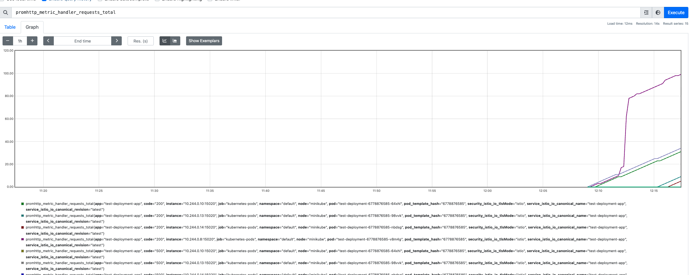
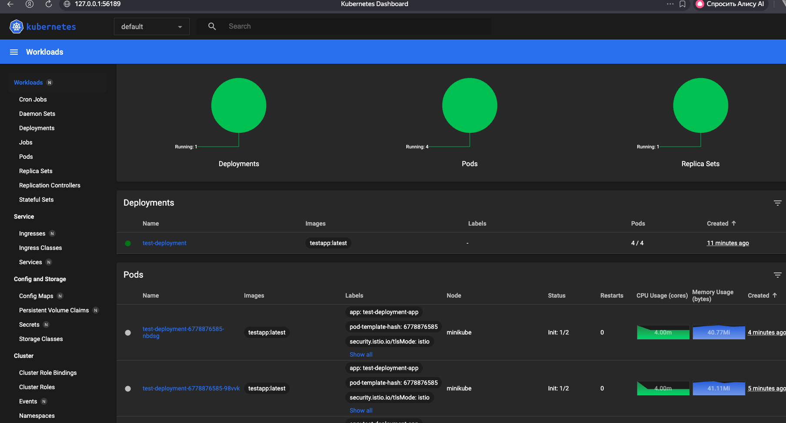
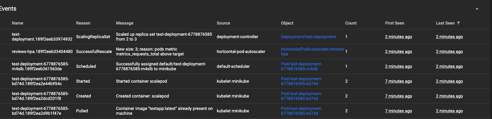
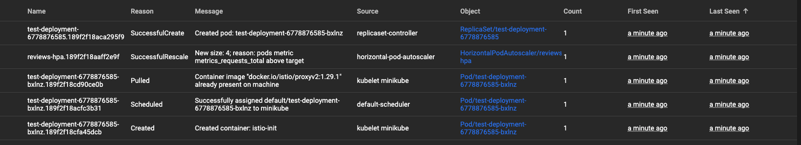

# Настройка среды Task1 (Масштабирование под память)

запускаем 
```
sh start.sh
```

- ставит istio
- запускает minikube
- настраивает окружения/deploymnet/hpa/service/deployment
- запускаем locus

чтобы запустить locust нужно 
```
pip install locust
locust
```
Переходим на localhost:9090 
выставляем значение User: 100000, Rumpup:1 Host: localhost:8080
Жмем старт

Prometheus выдает такой результат по количеству запросов: 


minukube dashboard отображает создание новых подов



# Настройка среды Task2 (Масштабирование под количество запросов)

запускаем 
```
sh start-2.sh
```

- ставит istio
- запускает minikube
- настраивает окружения/deploymnet/hpa/service/deployment
- запускаем locus

чтобы запустить locust нужно 
```
pip install locust
locust
```
Переходим на localhost:9090 
выставляем значение User: 100000, Rumpup:1 Host: localhost:8080
Жмем старт

HPA начинает создавать реплики относительно новых метрик
- 1 

- 2

